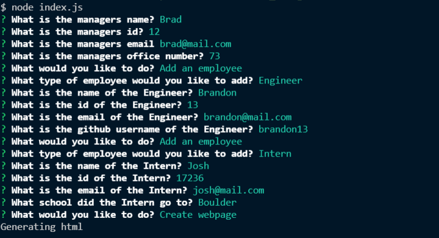

# teamProfileGenerator

## Description

A simple app that generates a team profile html based on users command line inputs

## Table of Contents

- [License](#license)
- [Installation](#installation)
- [Usage](#usage)
- [Contributing](#contributing)
- [Tests](#tests)
- [Questions](#questions)

## License

This project is licensed under GPL3.0. For more information please see [the liscense page](https://choosealicense.com/licenses/gpl-3.0/)

## Installation

To install necessary dependencies, run the following command: npm i

## Usage

Generate team profile page

Please see screenshot below:

[Video link](https://drive.google.com/file/d/1VB414SyZsyXiNE0z44Nan6XAIv4slSFR/view)

## Contributing

If you would like to contribute please email me at the address below

## Tests

To run tests, run the following command: npm test

## Questions

Please reach out with any questions at:  
GitHub: [bhodge166](https://github.com/bhodge166) 
Email: bhodge166@gmail.com
